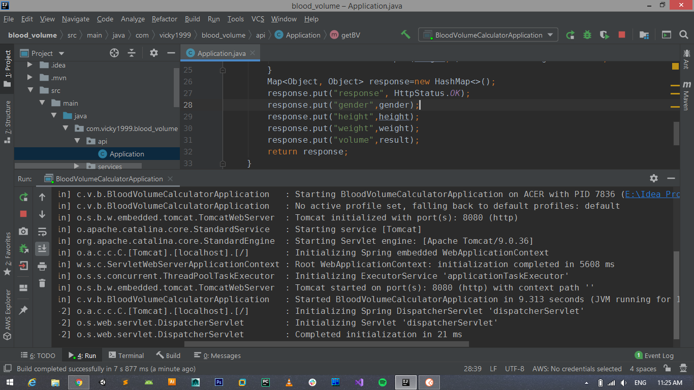
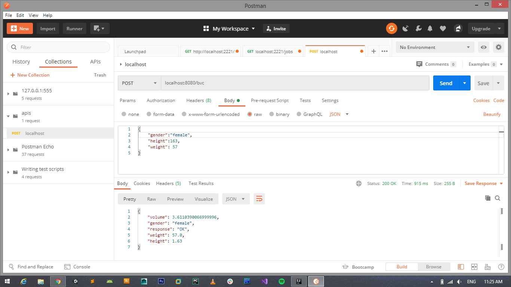

# Blood Volume Calculator
Blood volume calculator ia an API created using Spring boot. 
The formula was obtained from nadler's formula for calculating blood volume.

# Request Format for Body Mass Index 

{  
  "height":height in CM,  
  "weight": weight in KG  
}
 
# Response Format for Body Mass Index

{  
    "result": Result string ,   
    "response": "OK",  
    "weight": Weight in KG,  
    "height": Height in CM,  
    "bmi": BMI value  
}  

# Request Format for Blood Volume Calculation 

{  
  "gender":gender,  
  "height":height in CM,  
  "weight": weight in KG  
}
 
# Response Format for Blood Volume Calculation

{  
  "volume": Blood Volume in Litres,  
    "gender": gender,  
    "response": "OK",  
    "weight": weight in KG,  
    "height": Height in metres  
}  

